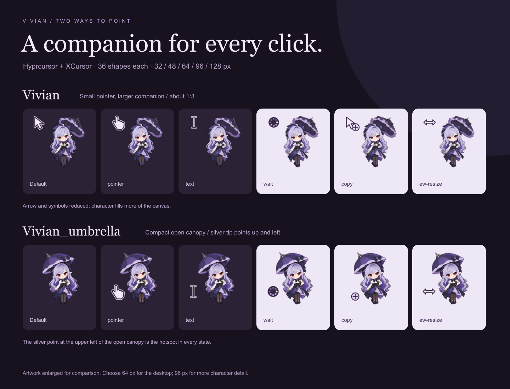

# Vivian cursors

Two animated chibi Vivian Banshee cursor themes for Hyprland, inspired by [hololive-x-cursors](https://github.com/yellowsink/hololive-x-cursors).

- **`Vivian`**: a smaller pointer alongside a larger character, approximately **1:3 by height**. The arrow or action symbol is the click point.
- **`Vivian_umbrella`**: a compact, open, rounded umbrella, only slightly wider than Vivian's neutral hair silhouette. Its silver tip points **up and left** and is the click point in every state. Small badges indicate text, links, resizing or other actions; the badges are not the click point.



## Included

- **Ready-to-install Hyprcursor and XCursor files** in each of the `Vivian/` and `Vivian_umbrella/` folders.
- 36 cursor shapes per theme, with common legacy aliases and all 34 standard Wayland cursor names.
- Sizes **32, 48, 64, 96 and 128 px**. Start with **64** for visible character detail, or 48 for a smaller desktop footprint. At 32, Vivian becomes a small decorative companion.
- Default, link pointer and help cursors gently sway and blink. Busy and progress indicators animate continuously. Precision cursors stay still. Click points never move between frames.
- Full source artwork, PNG frames, hotspot metadata, build scripts, and an interactive `preview.html`.

## Install on your Linux / Hyprland machine

**NixOS / Home Manager:** the default flake package installs both themes. Your existing `.packages.${pkgs.stdenv.hostPlatform.system}.default` package line can stay the same. See the [Nix installation guide](nix/README.md) for updating an existing installation and selecting either theme.

Extract the release archive, open a terminal in `vivian-cursors`, and run:

```sh
sh install.sh
hyprctl setcursor Vivian 64
```

The installer copies both theme folders to `${XDG_DATA_HOME:-$HOME/.local/share}/icons`. It refuses to overwrite either existing theme and does not edit your settings. Move old manually installed theme folders aside before running it. Hyprcursor normally finds themes in `~/.local/share/icons` and `~/.icons`. If you use a custom `XDG_DATA_HOME` and your compositor cannot find them, place the folders in `~/.local/share/icons` instead.

For persistence, add the following to your existing **hyprland.conf**:

```ini
env = HYPRCURSOR_THEME,Vivian
env = HYPRCURSOR_SIZE,64
env = XCURSOR_THEME,Vivian
env = XCURSOR_SIZE,64
```

If your Hyprland version uses **hyprland.lua**, use this equivalent instead:

```lua
hl.env("HYPRCURSOR_THEME", "Vivian_umbrella")
hl.env("HYPRCURSOR_SIZE", "64")
hl.env("XCURSOR_THEME", "Vivian_umbrella")
hl.env("XCURSOR_SIZE", "64")
```

The Lua example selects the umbrella variant; use `Vivian` for the smaller-arrow variant. Use the same chosen name in both `HYPRCURSOR_THEME` and `XCURSOR_THEME`, in GTK settings, and in Home Manager's pointerCursor name if you use it. Log out and back in so applications inherit these variables. Switch immediately with `hyprctl setcursor Vivian_umbrella 64` or `hyprctl setcursor Vivian 64`.

For GTK applications using XCursor and GNOME settings, also run:

```sh
gsettings set org.gnome.desktop.interface cursor-theme 'Vivian'
gsettings set org.gnome.desktop.interface cursor-size 64
```

If that schema is unavailable, set `gtk-cursor-theme-name=Vivian` and `gtk-cursor-theme-size=64` in the existing `[Settings]` section of `~/.config/gtk-3.0/settings.ini` and, if applicable, `~/.config/gtk-4.0/settings.ini`. Restart affected applications. Instructions follow the [Hyprland cursor documentation](https://wiki.hypr.land/Hypr-Ecosystem/hyprcursor/).

## Preview and customize

Open `preview.html` in a browser. Choose a theme and a shape, choose a size, and move over the pale panel. Animation can be switched off in this preview. Browser cursor size limits may affect the largest preview sizes; the installed themes are independent of the browser.

`assets/vivian-atlas.png` and `assets/vivian-umbrella-atlas.png` contain the character frames. `assets/umbrella-layout.json` records the actual cell boundaries of the umbrella atlas. `source/hyprcursors/<shape>/meta.hl` describes the original variant; `source-umbrella/` contains the umbrella variant. Both contain size, timing, alias and hotspot metadata. The working-state files can also be compiled with the official utility:

```sh
mkdir -p work/recompiled
hyprcursor-util --create source --output work/recompiled
hyprcursor-util --create source-umbrella --output work/recompiled
```

Use hyprcursor-util 0.1.2 or newer. These commands create `theme_Vivian` and `theme_Vivian_umbrella` under `work/recompiled`, containing only the Hyprcursor part. Keep the supplied XCursor files for applications that need them.

To rebuild both formats from the atlas, install Node.js, Python 3, and the image dependency, then run:

```sh
npm install
npm run build
```

The build regenerates both theme folders, both source folders, cursor maps and previews. Edit `scripts/build.cjs` to change symbols or hotspots; metadata-only edits are overwritten by that rebuild. The `.hlc` packer uses the same ZIP-of-PNGs-and-meta structure as `hyprcursor-util`; the XCursor writer emits premultiplied ARGB image chunks. Neither compiler needs to be installed to use the already built themes.

## Validation and limits

Both theme payloads are validated before packaging for PNG integrity, animation timing, hotspots, aliases and cursor formats. Verification scripts and flake check outputs are deliberately excluded from this release; only the build and pack scripts are included. It was built on macOS, so **live Hyprland rendering and a full Nix build have not been tested here**. Application and compositor support determine whether animated frames are displayed.

To uninstall, switch to another theme, remove the Vivian environment settings, then remove the manually installed theme folders or remove the package from your Nix configuration.

## References and artwork

- [Hololive X Cursors](https://github.com/yellowsink/hololive-x-cursors): reference for an animated character theme and fixed cursor hotspots. No Hololive artwork or code is included.
- [Hyprcursor](https://github.com/hyprwm/hyprcursor), its [theme format guide](https://github.com/hyprwm/hyprcursor/blob/main/docs/MAKING_THEMES.md), and [utility instructions](https://github.com/hyprwm/hyprcursor/tree/main/hyprcursor-util): packaging and metadata format.
- [X.Org Xcursor format](https://xorg.freedesktop.org/archive/X11R6.8.1/doc/Xcursor.3.html): XCursor binary format.
- [Official Vivian character artwork](https://zenless.hoyoverse.com/de-de/news/155542): character design reference.

Character artwork was generated with the built-in image-generation tool. The prompts are recorded in [ARTWORK.md](ARTWORK.md) and [ARTWORK-UMBRELLA.md](ARTWORK-UMBRELLA.md). This is unofficial fan art; Vivian and Zenless Zone Zero belong to their respective rights holders. No affiliation or endorsement is implied. The MIT license in `LICENSE-CODE` covers only the build scripts and original interface code, not the character IP or generated artwork.
